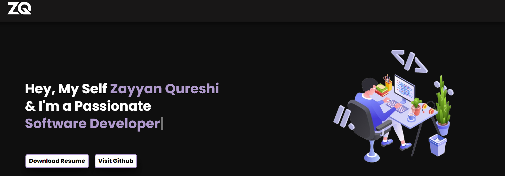
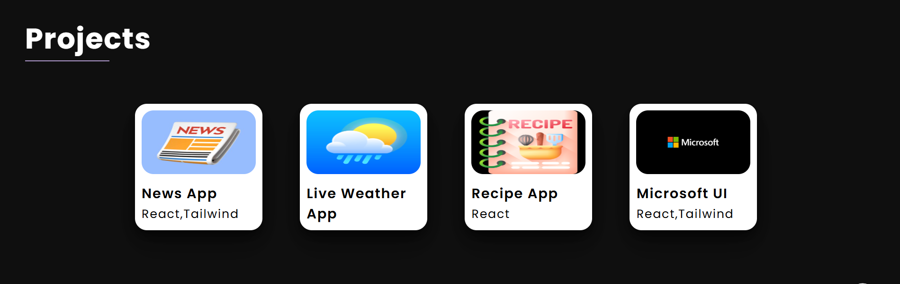

# Developer Portfolio

Welcome to my Developer Portfolio! This project showcases my skills, projects, and experience as a web developer. It’s built with modern technologies to ensure a sleek, responsive, and user-friendly design.

---

## 🌟 Features

- **Responsive Design**: Optimized for all screen sizes, from desktops to mobile devices.
- **Interactive UI**: Smooth animations and transitions for an enhanced user experience.
- **Showcase Projects**: Highlights my key projects with detailed descriptions and live links.
- **Blog Section**: Added Blog Section

---

## 🛠️ Tech Stack

  

---

## 📌 Live Link

> 🔗 Live : https://zayyanqureshi.vercel.app/ 

